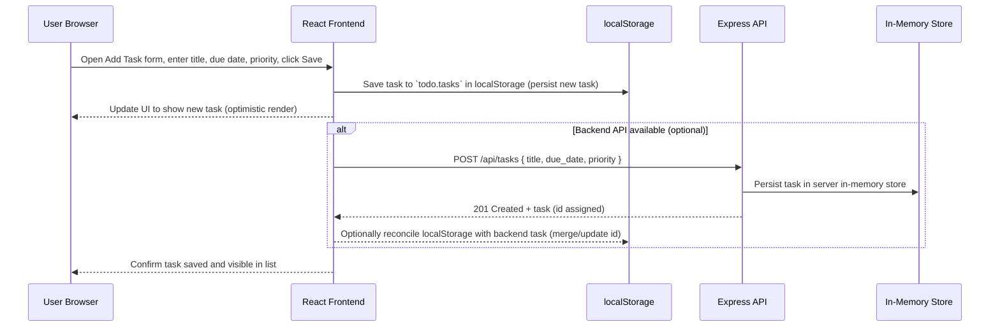

# Cloud Architecture Overview

This document provides a simple system context diagram and brief overview for the Todo app monorepo (React frontend + Express API). The diagram shows the main runtime components and data flow. For the MVP the app uses local/in-memory persistence; the architecture leaves room for future backend or cloud persistence.

```mermaid
graph TD
  subgraph Frontend
    FE[React Frontend (packages/frontend)]
  end

  subgraph Backend
    API[Express API (packages/backend)]
    IM[In-Memory Store / Local Storage]
  end

  User[User Browser]

  User -->|HTTP / UI| FE
  FE -->|XHR / Fetch| API
  FE -->|localStorage| IM
  API -->|in-memory DB| IM

  classDef infra fill:#f3f4f6,stroke:#e5e7eb;
  class Frontend,Backend infra;
```

Notes:
- Frontend: React app served from dev server or static assets; interacts with the local storage adapter and optionally the Express API.
- Backend: Express exposes REST endpoints for tasks. For MVP we prefer a local-storage/in-memory approach; the Express API can be used if the project chooses to run a backend in this environment.
- Persistence: Local storage in the browser is the primary persistence for the MVP. The in-memory store denotes any server-side in-memory data used by the Express API during development.

Next steps:
- Add an infra diagram showing deployment targets (Netlify/Vercel for frontend, Heroku/DigitalOcean for API) if you plan to deploy.
- Document the local-storage adapter interface used by the frontend.

## Sequence: Creating a TODO (user flow)

The sequence diagram below demonstrates the primary flow for creating a task in the MVP (localStorage), with an optional backend path if the Express API is used.



